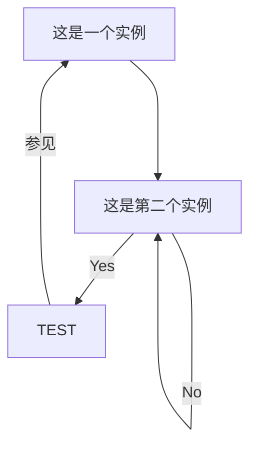

**aaaaaa**  
_bbb_  
ccccc
**asdfasd**
#aaaaa 
~~aaa~~    


```java
public class A{
    
}
```
```flow
st=>start: Start
i=>inputoutput: 输入年份n
cond1=>condition: n能否被4整除？
cond2=>condition: n能否被100整除？
cond3=>condition: n能否被400整除？
o1=>inputoutput: 输出非闰年
o2=>inputoutput: 输出非闰年
o3=>inputoutput: 输出闰年
o4=>inputoutput: 输出闰年
e=>end
st->i->cond1
cond1(no)->o1->e
cond1(yes)->cond2
cond2(no)->o3->e
cond2(yes)->cond3
cond3(yes)->o2->e
cond3(no)->o4->e
```
